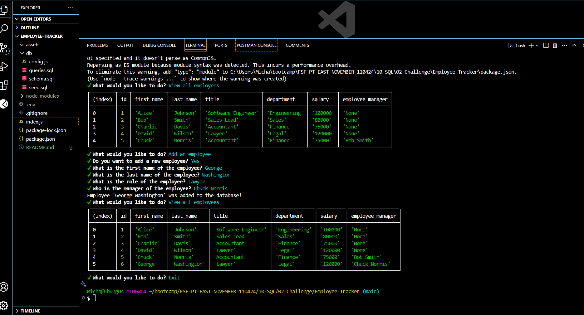

# Professional README Generator

  

  ## Description
Employee Tracker is a command-line content management system (CMS) designed to help business owners efficiently manage their company's employee database. Built with Node.js, Inquirer, and PostgreSQL, the application allows users to perform key operations such as viewing and managing departments, roles, and employees through a simple and interactive terminal-based interface.

This project provides hands-on experience working with relational databases and dynamic user prompts, making it a powerful tool for understanding how backend systems can support business needs.

  ## Table of Contents
  - [Installation](#Installation)
  - [Usage](#Usage)
  - [Screenshot](#Screenshot)
  - [Walkthrough Video](#Walkthrough-Video)
  - [Deployment](#Deployment)
  - [Contribution](#Contribution)
  - [Tests](#Tests)
  - [License](#License)
  - [Questions](#Questions)

  ## Installation
  To install this project, clone the repository and run the following command in the terminal to install dependencies:

    npm install

  Set up your PostgreSQL database using the provided schema and seed files. Be sure to update your database connection information in the environment file (.env):

    DB_NAME=your_db_name
    DB_USER=your_postgres_username
    DB_PASSWORD=your_postgres_password
  ## Usage
  Invoke the application from the command line using:

    node index.js

  Upon starting, you will be presented with the following options:

    View all departments

    View all roles

    View all employees

    Add a department

    Add a role

    Add an employee

    Update an employee role

  Select an option and follow the prompts to interact with the database. All views return a formatted table of the requested data.

  ## Screenshot

  ## Walkthrough Video
https://drive.google.com/file/d/1o9bd6boSh_Q17Ld3DTt6ve-86HROkpOX/view

  ## Deployment
  This application is intended to be used locally and is not deployed on the web. You can clone or fork the repository to use it on your machine.

  ## Contribution
  Contributions are welcome! If you have suggestions or improvements, feel free to fork the repo and submit a pull request.

  ## Tests
  You can manually test the application by:

    Adding a new department, role, or employee

    Viewing updated data using the corresponding view options

    Updating an employee’s role and confirming changes
    
  ## License

This project is licensed under the BSD license.
 

  ## Questions
  If you have any questions, please contact me at michael.mangieri@yahoo.com.

  You can find more of my work at [github.com/hazyplebian]

